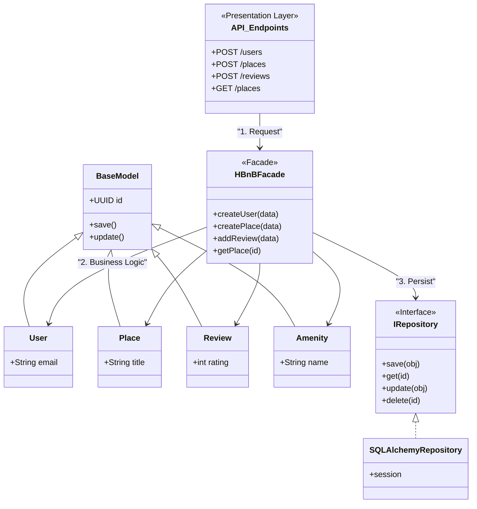

# holbertonschool-hbnb

## Package Diagram

```mermaid

classDiagram
    direction TB

    class API_Endpoints {
        <<Presentation Layer>>
        +POST /users
        +POST /places
        +POST /reviews
        +GET /places
    }

    class HBnBFacade {
        <<Facade>>
        +createUser(data)
        +createPlace(data)
        +addReview(data)
        +getPlace(id)
    }

    class User {
        +String email
    }
    class Place {
        +String title
    }
    class Review {
        +int rating
    }
    class Amenity {
        +String name
    }
    
    class BaseModel {
        +UUID id
        +save()
        +update()
    }

    class IRepository {
        <<Interface>>
        +save(obj)
        +get(id)
        +update(obj)
        +delete(id)
    }

    class SQLAlchemyRepository {
        +session
    }

    %% Relations
    API_Endpoints --> HBnBFacade : "1. Request"
    
    HBnBFacade --> User : "2. Business Logic"
    HBnBFacade --> Place
    HBnBFacade --> Review
    HBnBFacade --> Amenity

    HBnBFacade --> IRepository : "3. Persist"

    %% Héritage
    BaseModel <|-- User
    BaseModel <|-- Place
    BaseModel <|-- Review
    BaseModel <|-- Amenity

    %% Implémentation
    IRepository <|.. SQLAlchemyRepository

```

