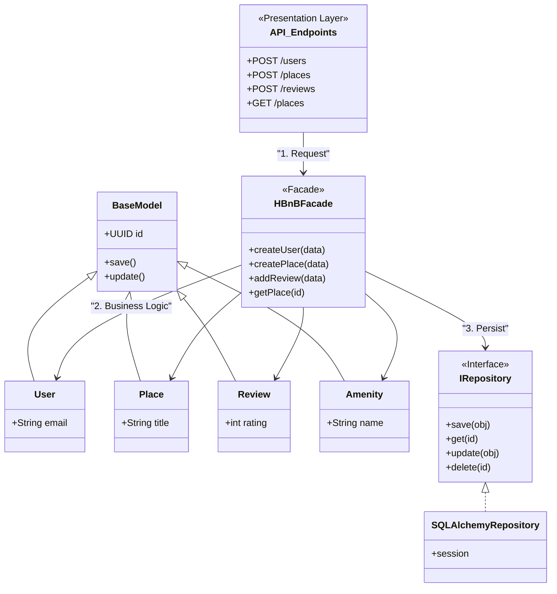

# holbertonschool-hbnb

## Package Diagram

## Architecture Overview

This project follows a layered architecture combined with the Facade pattern and the Repository pattern.

## Presentation Layer – API Endpoints

The `API_Endpoints` class represents the presentation layer of the application.  
It exposes HTTP routes such as:

- `POST /users`
- `POST /places`
- `POST /reviews`
- `GET /places`

This layer is responsible for handling incoming HTTP requests and forwarding them to the business layer.

---

## Business Layer – HBnBFacade

The `HBnBFacade` acts as a Facade.

It provides simplified methods such as:

- `createUser(data)`
- `createPlace(data)`
- `addReview(data)`
- `getPlace(id)`

The facade centralizes the business logic and coordinates interactions between models and repositories.

This design:
- Reduces coupling
- Simplifies the API layer
- Improves maintainability

---
## Domain Models

The main entities of the system are:

- `User`
- `Place`
- `Review`
- `Amenity`

All of them inherit from `BaseModel`, which provides:

- A unique identifier (`UUID id`)
- Common methods (`save()`, `update()`)

This promotes code reuse and consistency.

---
