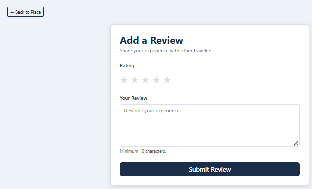

# HBnB Evolution

> A full-stack Airbnb-like platform built in 4 incremental parts — from UML design to a production-ready REST API with JWT auth, SQLAlchemy persistence, and a Vanilla JS frontend.

---

## Overview

HBnB Evolution is a Holberton School capstone project built collaboratively across 4 parts:

| Part | Description | Stack |
|---|---|---|
| [Part 1](./part1-design/) | System design — UML, class diagrams, API blueprints | Diagrams only |
| [Part 2](./part2-backend-v1/) | REST API with in-memory storage, no auth | Flask, Flask-RESTX |
| [Part 3](./part3-backend/) | Persistence, JWT auth, RBAC | Flask, SQLAlchemy, JWT |
| [Part 4](./part4-frontend/) | Vanilla JS frontend consuming the Part 3 API | HTML, CSS, JavaScript |

---

## Architecture

The backend follows a strict 3-layer facade pattern:

```
Presentation  →  app/api/v1/       (Flask-RESTX namespaces)
Business      →  app/services/     (HBnBFacade — single entry point)
Persistence   →  app/persistence/  (Repository pattern: in-memory or SQLAlchemy)
```

API endpoints call only `HBnBFacade` methods — never models or repositories directly.

---

## Prerequisites

- Python 3.8+
- pip
- SQLite3 (for Part 3 dev mode)
- A modern browser (for Part 4)

---

## Quick Start

### Part 3 (Backend — recommended entry point)

```bash
cd part3-backend
python3 -m venv .venv
source .venv/bin/activate
pip install -r requirements.txt
cp .env.example .env          # set SECRET_KEY and JWT_SECRET_KEY
python3 run.py
```

API available at `http://127.0.0.1:5000/api/v1/`
Swagger UI at `http://127.0.0.1:5000/api/v1/` (interactive docs)

### Part 4 (Frontend)

With Part 3 running, open `part4-frontend/index.html` in a browser or serve it statically:

```bash
cd part4-frontend
python3 -m http.server 8080
# Open http://localhost:8080
```

Default admin credentials: `admin@hbnb.io` / `admin1234`

---

## Features

- **JWT Authentication** — login returns a signed token; protected endpoints require it
- **Role-Based Access Control** — admins can create users and amenities; owners manage their own resources
- **SQLAlchemy ORM** — SQLite in development, configurable for MySQL in production
- **Many-to-many relationships** — places and amenities via association table
- **Price filter** — frontend filters places client-side by max price
- **Swagger UI** — full interactive API documentation built-in
- **61-test suite** — covers auth, RBAC, models, relationships, and SQL scripts

---

## Screenshots

| Home | Login |
|---|---|
|  |  |

| Place Details | Add Review |
|---|---|
|  |  |

---

## Running Tests

```bash
cd part3-backend
source .venv/bin/activate
python3 -m pytest app/tests/ -v
```

---

## Branch Strategy

| Branch | Purpose |
|---|---|
| `main` | Stable, deployable code |
| `develop` | Active development and feature integration |
| `testing` | QA and test validation before merging to main |

---

## Author

- **Julian Gonzalez** — [@juliangf94](https://github.com/juliangf94)
