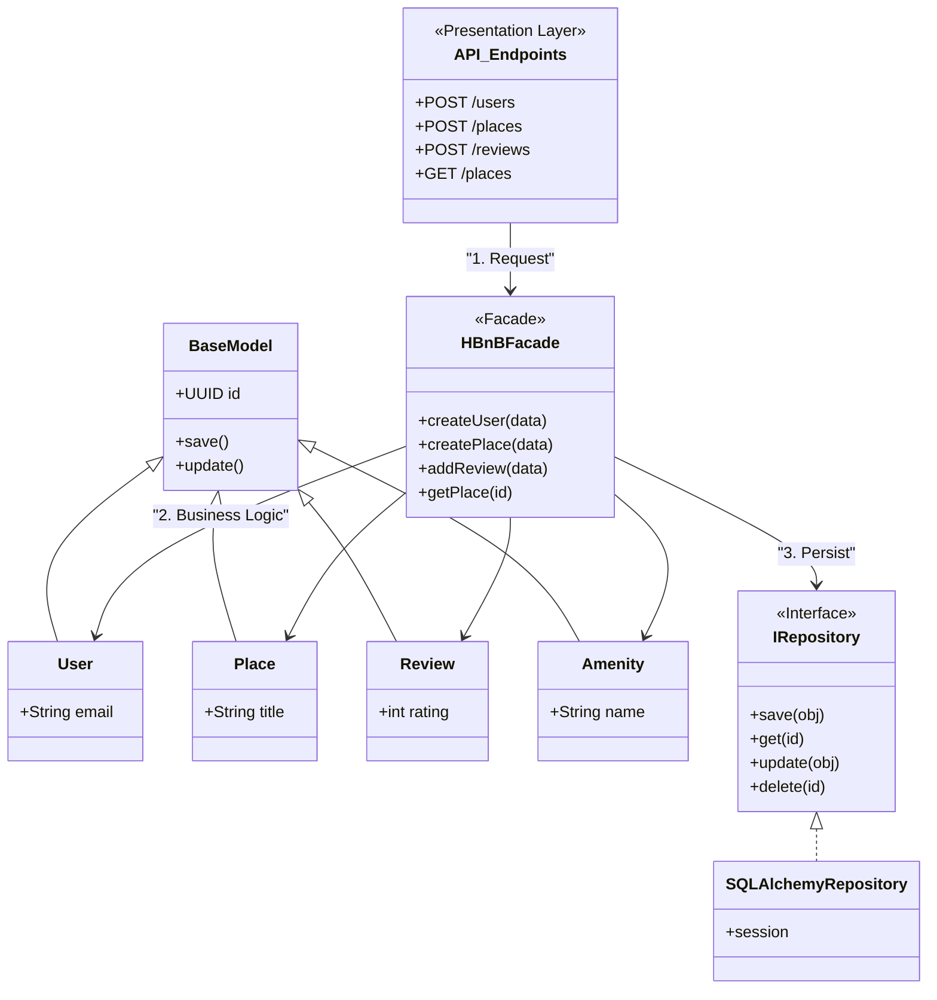
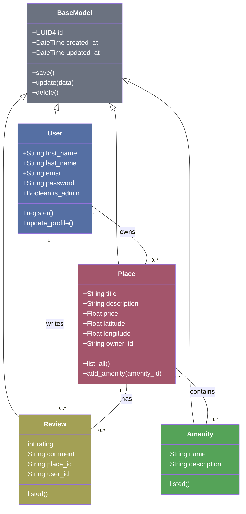
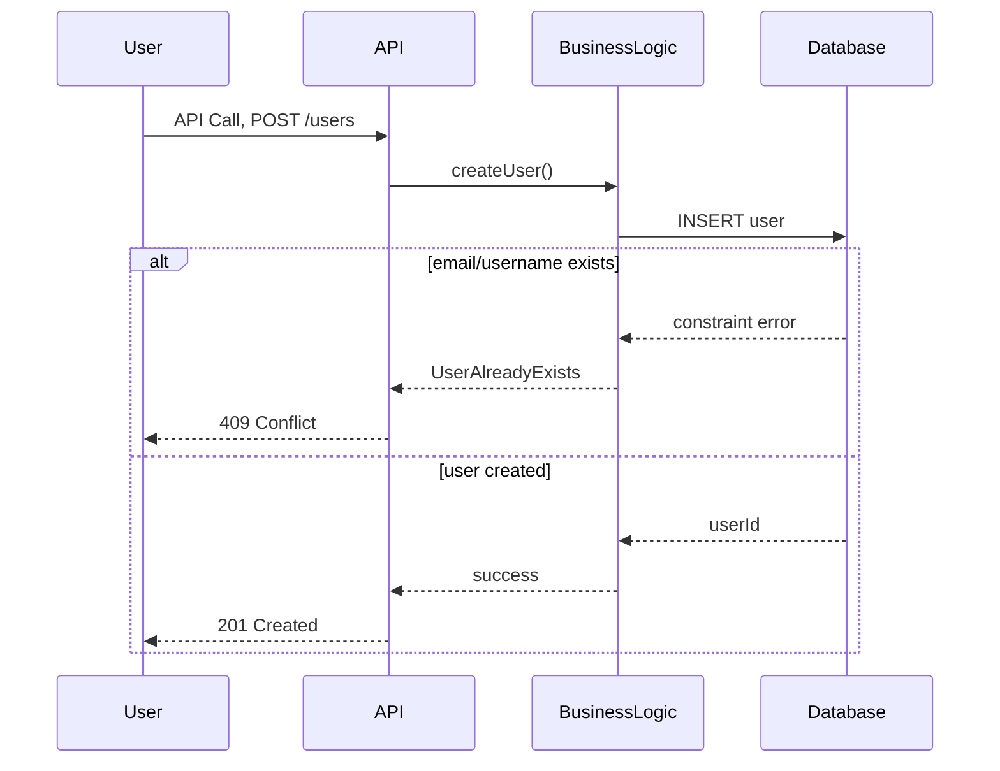
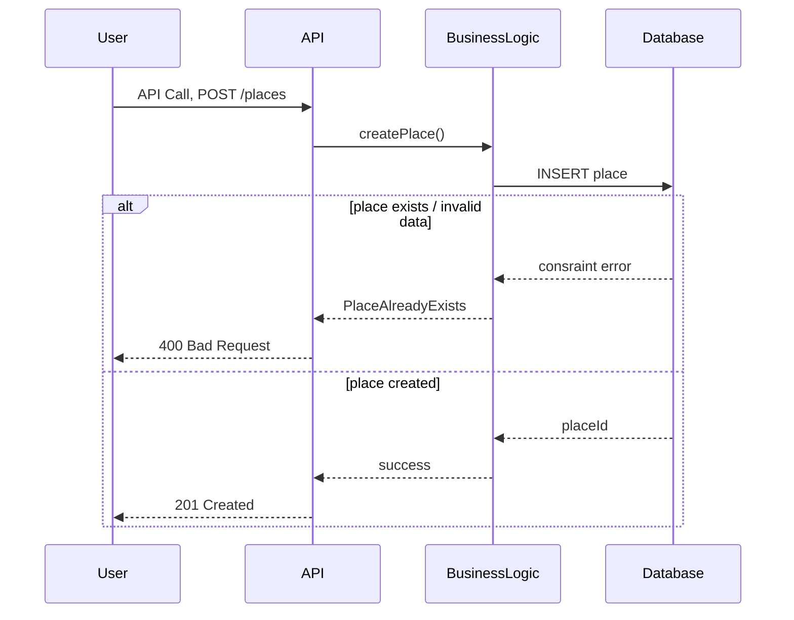
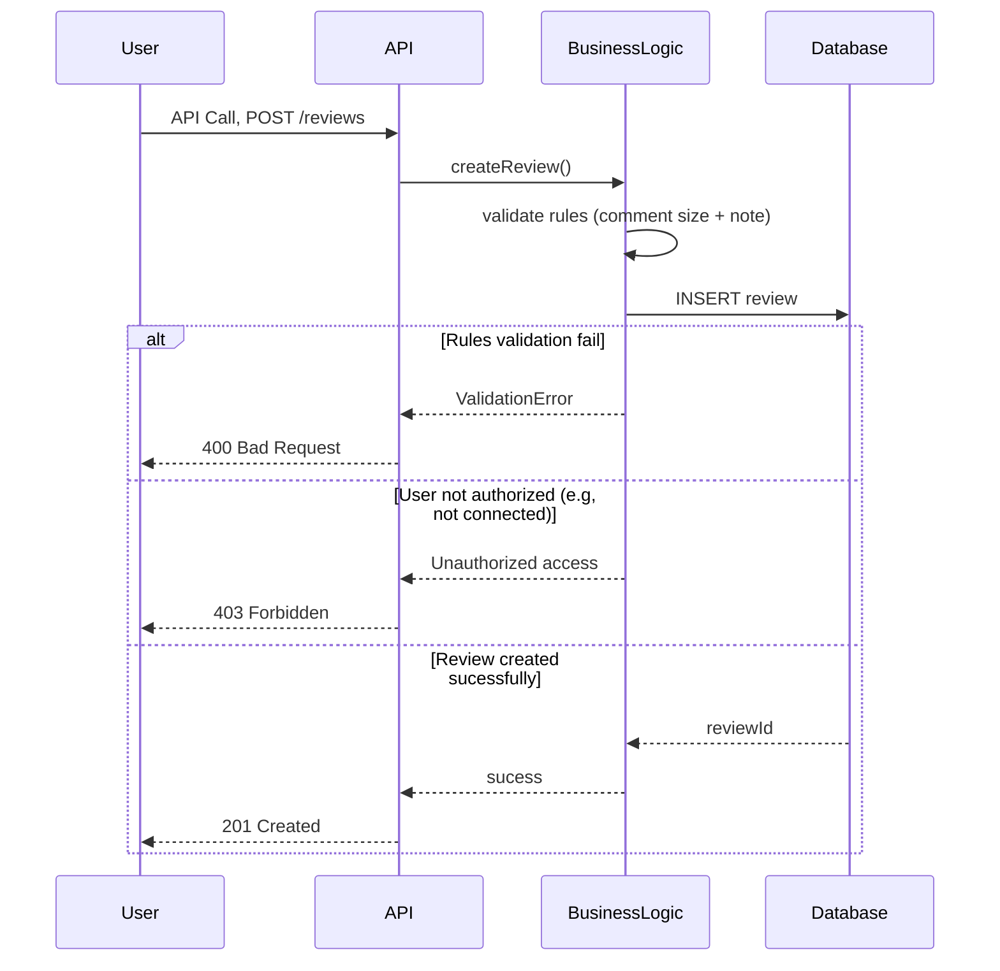
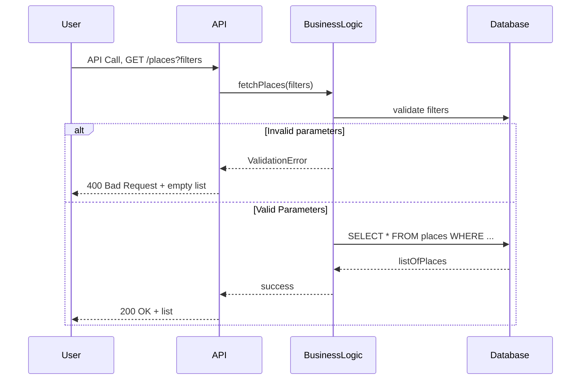

# HBnB Evolution: Technical Documentation

## 0. Package Diagram

# Architecture Overview

This project follows a layered architecture combined with the Facade pattern and the Repository pattern.

## Presentation Layer – API Endpoints

The `API_Endpoints` class represents the presentation layer of the application.  
It exposes HTTP routes such as:

- `POST /users`
- `POST /places`
- `POST /reviews`
- `GET /places`

This layer is responsible for handling incoming HTTP requests and forwarding them to the business layer.

---

## Business Layer – HBnBFacade

The `HBnBFacade` acts as a Facade.

It provides simplified methods such as:

- `createUser(data)`
- `createPlace(data)`
- `addReview(data)`
- `getPlace(id)`

The facade centralizes the business logic and coordinates interactions between models and repositories.

This design:
- Reduces coupling
- Simplifies the API layer
- Improves maintainability

---
## Domain Models

The main entities of the system are:

- `User`
- `Place`
- `Review`
- `Amenity`

All of them inherit from `BaseModel`, which provides:

- A unique identifier (`UUID id`)
- Common methods (`save()`, `update()`)

This promotes code reuse and consistency.

---

# Persistence Layer – Repository Pattern

The project uses the Repository pattern to abstract database operations.

## `IRepository` (Interface)
Defines generic methods:
- `save(obj)`
- `get(id)`
- `update(obj)`
- `delete(id)`

## `SQLAlchemyRepository`
Implements `IRepository` using SQLAlchemy and manages database sessions.

The facade interacts only with the `IRepository` interface, not directly with SQLAlchemy.  
This makes the system more flexible and easier to test.

## Flow of a Request
1. The client sends a request to an API endpoint.
2. The API layer forwards the request to `HBnBFacade`.
3. The facade applies business logic.
4. The facade calls the repository to persist or retrieve data.
5. The repository interacts with the database.

---
## 1. Business Logic Layer - Class Diagram

#   Explanatory Notes
##   Entities:
-   BaseModel: The foundation of all classes. It encapsulates the UUID4 unique identifier and audit timestamps (created_at, updated_at), ensuring that every object in the system is traceable and unique.

-   User: Represents a registered individual. It holds essential data like email and password, and manages roles (admin vs. regular user).

-   Place: Represents the properties listed. It includes geographical coordinates and pricing.

-   Review: A feedback entity that links a User with a Place through a rating and a comment.

-   Amenity: Standalone features (like "WiFi" or "Pool") that enhance a Place.

##  Relationships:
-   Inheritance: All core entities inherit from `BaseModel`, promoting code reuse and a standardized data structure for auditing. By centralizing these attributes, any future entities added to the system will automatically inherit the ability to be uniquely identified via UUID4 and tracked through creation and update timestamps.

-   Many-to-Many (Place ↔ Amenity): Modeled this way because a single property can have multiple amenities, and a single type of amenity can be associated with many properties.

-   One-to-Many (User → Place/Review): A user can own multiple places and write multiple reviews, but each place/review belongs to a single author/owner.

## 3. User Registration - Sequence Diagram

#   Explanatory Notes
##   Brief Description :
-   This API call allows a new user to register in the system by submitting required information such as email, username, and password.
-   The purpose of the sequence diagram is to illustrate how the system validates the input, processes the registration request, and either creates the user or returns an appropriate error response.

##  Flow of Interactions :
-   The User sends a POST /users request to the API layer with the user's registration data.
-   The API recieves the request and forwards it to the Business Logic layer.
-   The Business Logic validates the input and Attempts to create the user in the Database.
-   The Database enforces constraints, such as unique username or email
-   If constraint is violated, the error is propagated:
    -   Business Logic translate it into a meaningful error.
    -   API returns Code 409 (Conflict).
-   If the registration is successful:
    -   The database returns the new user ID.
    -   API respond with code 201 (Created).

-   Each layer contributes as follows:
    -   API: Handles HTTP Communication
    -   Business Logic: Applies rules and orchetrates operations
    -   Database: Ensure Data integrity and persistence

## 4. Place Creation - Sequence Diagram

#   Explanatory Notes
##   Brief Description :
-   This API call allows an authenticated user to create a new place listing (similar to Airbnb).
-   The sequence diagram shows how the system validates the submitted data and stores the new place in the database.

##  Flow of Interactions :
-   The User sends a POST /places request containing place details.
-   The API recieves the request and forwards it to the Business Logic layer.
-   The Business Logic validates the input and sends an insert request to the Database.
-   The Database stores the new place and returns the unique Place ID
-   If constraint is violated, the error is propagated:
    -   API returns code 400 (Bad Request)
-   If the registration is successful:
    -   API respond with code 201 (Created).

-   Each layer contributes as follows:
    -   API: Handles HTTP Communication
    -   Business Logic: Applies rules and validation
    -   Database: Enforces constraints and persistance

## 5. Review Submission - Sequence Diagram

#   Explanatory Notes
##   Brief Description :
-   This API call allows a user to submit a review for a place, including a rating and a comment.
-   The sequence diagram illustrates how the system validates review content and stores it.

##  Flow of Interactions :
-   The User sends a POST /reviews request with a rating, a comment and a place ID
-   The API recieves the request and forwards it to the Business Logic layer.
-   The Business Logic validates that the rating is within the allowed range (for exemple, 1-5), Ensure that the comment exists and that the user exists or is connected.
-   The Database enforces constraints, such as unique username or email
-   If the validation fail:
    -   API returns code 400 (Bad Request)
-   If the user doesn't exist or isn't connected:
    -   API returns code 403 (Forbidden)
-   If validation passes:
    -   Business Logic insert the review in the Database
    -   Database returns a review ID
    -   API returns code 201 (Created)

-   -   Each layer contributes as follows:
    -   API: Handles HTTP Request/Response
    -   Business Logic: Enforces rules and authorize review 
    -   Database: Store review data

## 6. Fetching a List of Places - Sequence Diagram

#   Explanatory Notes
##   Brief Description :
-   This API call retrieves a list of places based on filtering criteria (e.g., city, price range, number of guests).
-   The sequence diagram demonstrates how the system processes filter parameters and retrieves matching results.

##  Flow of Interactions :
-   The User sends a POST /places request with query parameters (Example : /places?city=Paris&price_max=100)
-   The API forwards the filters to the Business Logic layer
-   The Business Logic validates the parameters and constructs the query
-   The Database execute a SELECT query using the filters
-   The API responds with:
    -   Code 200 (OK)
    -   A JSON array of places if the parameters are valid, an empty list if not

-   Each layer contributes as follows:
    -   API: Handles HTTP GET and response formatting
    -   Business Logic: Validate filters and build queries.
    -   Database: Executes Search and returns results