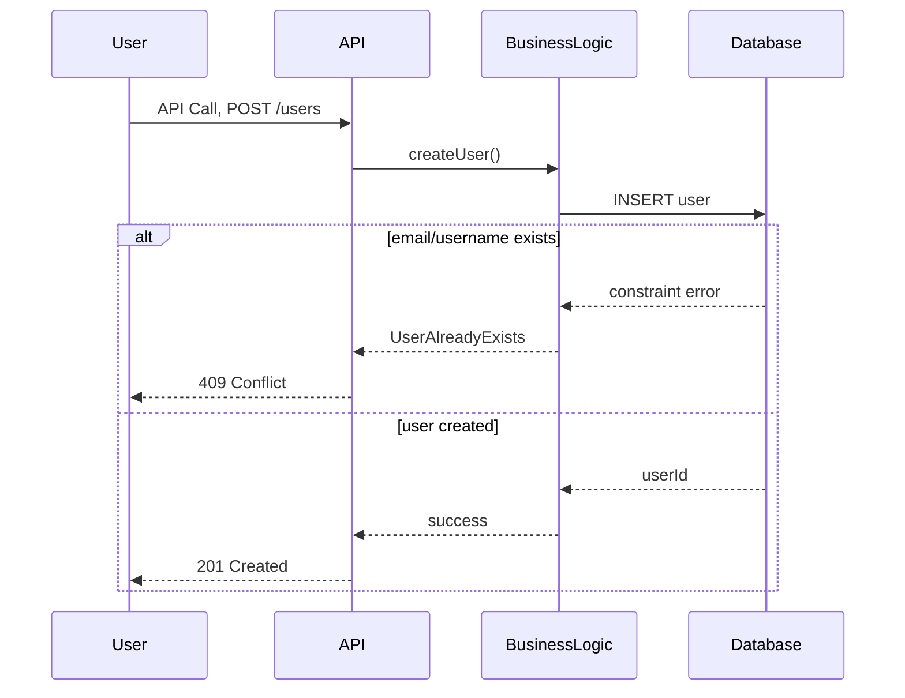

# HBnB Evolution: Technical Documentation
## 3. User Registration - Sequence Diagram

#   Explanatory Notes
##   Entities:
-   BaseModel: The foundation of all classes. It encapsulates the UUID4 unique identifier and audit timestamps (created_at, updated_at), ensuring that every object in the system is traceable and unique.

-   User: Represents a registered individual. It holds essential data like email and password, and manages roles (admin vs. regular user).

-   Place: Represents the properties listed. It includes geographical coordinates and pricing.

-   Review: A feedback entity that links a User with a Place through a rating and a comment.

-   Amenity: Standalone features (like "WiFi" or "Pool") that enhance a Place.

##  Relationships:
-   Inheritance: All core entities inherit from `BaseModel`, promoting code reuse and a standardized data structure for auditing. By centralizing these attributes, any future entities added to the system will automatically inherit the ability to be uniquely identified via UUID4 and tracked through creation and update timestamps.

-   Many-to-Many (Place ↔ Amenity): Modeled this way because a single property can have multiple amenities, and a single type of amenity can be associated with many properties.

-   One-to-Many (User → Place/Review): A user can own multiple places and write multiple reviews, but each place/review belongs to a single author/owner.