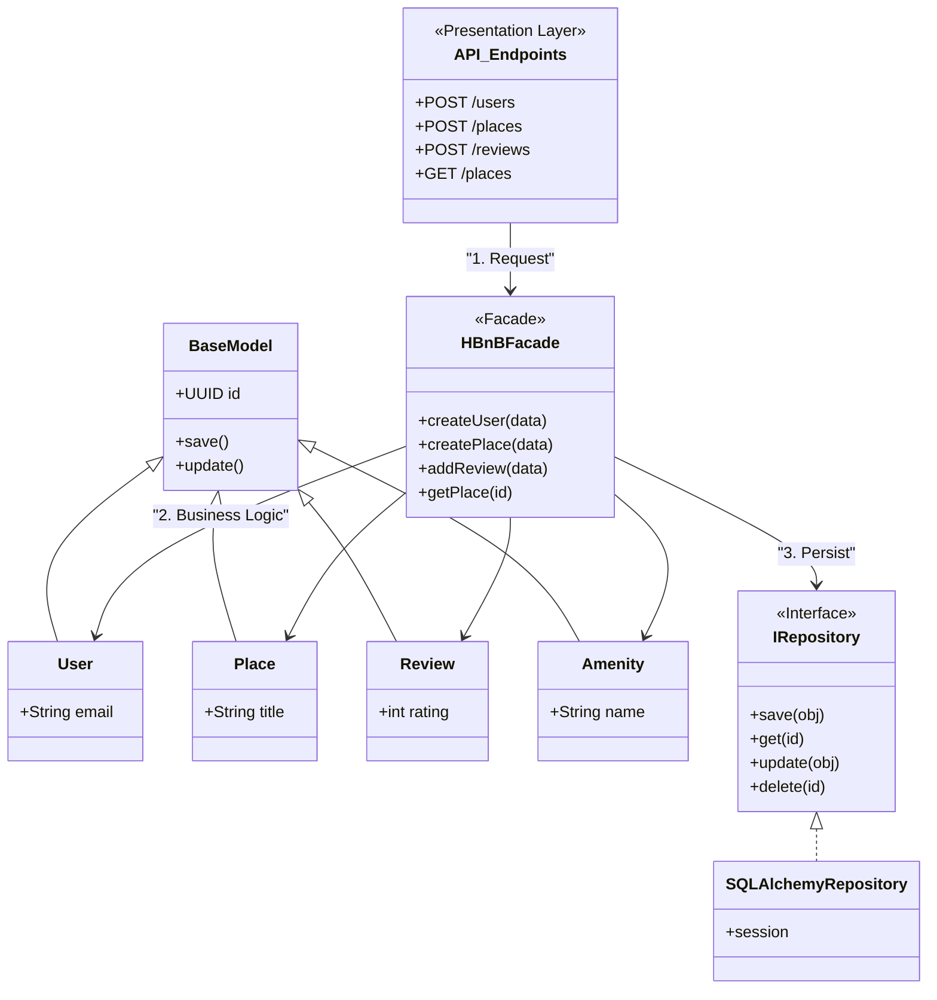
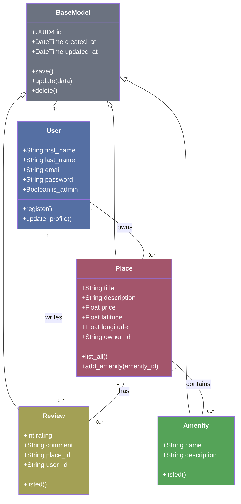

# HBnB Evolution: Technical Documentation

## 0. Package Diagram

# Architecture Overview

This project follows a layered architecture combined with the Facade pattern and the Repository pattern.

## Presentation Layer – API Endpoints

The `API_Endpoints` class represents the presentation layer of the application.  
It exposes HTTP routes such as:

- `POST /users`
- `POST /places`
- `POST /reviews`
- `GET /places`

This layer is responsible for handling incoming HTTP requests and forwarding them to the business layer.

---

## Business Layer – HBnBFacade

The `HBnBFacade` acts as a Facade.

It provides simplified methods such as:

- `createUser(data)`
- `createPlace(data)`
- `addReview(data)`
- `getPlace(id)`

The facade centralizes the business logic and coordinates interactions between models and repositories.

This design:
- Reduces coupling
- Simplifies the API layer
- Improves maintainability

---
## Domain Models

The main entities of the system are:

- `User`
- `Place`
- `Review`
- `Amenity`

All of them inherit from `BaseModel`, which provides:

- A unique identifier (`UUID id`)
- Common methods (`save()`, `update()`)

This promotes code reuse and consistency.

---

# Persistence Layer – Repository Pattern

The project uses the Repository pattern to abstract database operations.

## `IRepository` (Interface)
Defines generic methods:
- `save(obj)`
- `get(id)`
- `update(obj)`
- `delete(id)`

## `SQLAlchemyRepository`
Implements `IRepository` using SQLAlchemy and manages database sessions.

The facade interacts only with the `IRepository` interface, not directly with SQLAlchemy.  
This makes the system more flexible and easier to test.

## Flow of a Request
1. The client sends a request to an API endpoint.
2. The API layer forwards the request to `HBnBFacade`.
3. The facade applies business logic.
4. The facade calls the repository to persist or retrieve data.
5. The repository interacts with the database.

---
## 1. Business Logic Layer - Class Diagram

#   Explanatory Notes
##   Entities:
-   BaseModel: The foundation of all classes. It encapsulates the UUID4 unique identifier and audit timestamps (created_at, updated_at), ensuring that every object in the system is traceable and unique.

-   User: Represents a registered individual. It holds essential data like email and password, and manages roles (admin vs. regular user).

-   Place: Represents the properties listed. It includes geographical coordinates and pricing.

-   Review: A feedback entity that links a User with a Place through a rating and a comment.

-   Amenity: Standalone features (like "WiFi" or "Pool") that enhance a Place.

##  Relationships:
-   Inheritance: All core entities inherit from `BaseModel`, promoting code reuse and a standardized data structure for auditing. By centralizing these attributes, any future entities added to the system will automatically inherit the ability to be uniquely identified via UUID4 and tracked through creation and update timestamps.

-   Many-to-Many (Place ↔ Amenity): Modeled this way because a single property can have multiple amenities, and a single type of amenity can be associated with many properties.

-   One-to-Many (User → Place/Review): A user can own multiple places and write multiple reviews, but each place/review belongs to a single author/owner.
