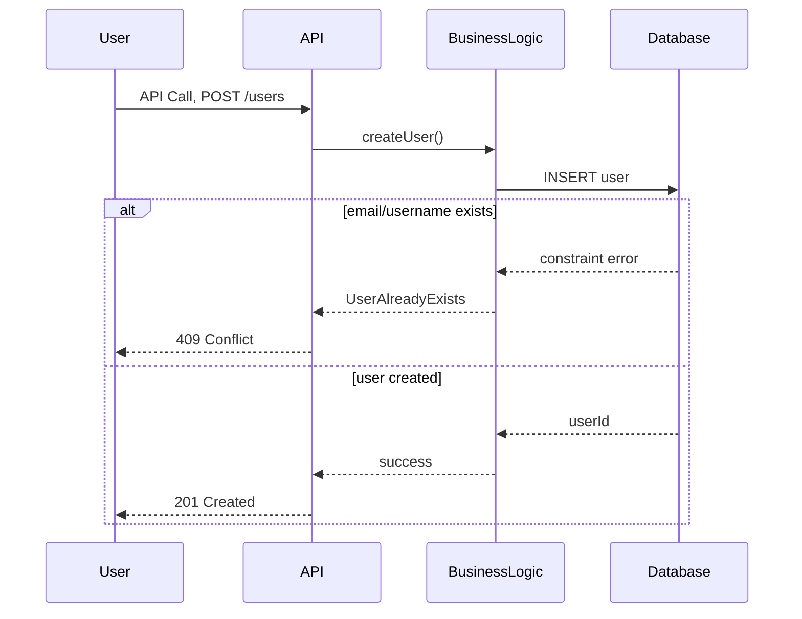

# HBnB Evolution: Technical Documentation
## 3. User Registration - Sequence Diagram

#   Explanatory Notes
##   Brief Description :
-   This API call allows a new user to register in the system by submitting required information such as email, username, and password.
-   The purpose of the sequence diagram is to illustrate how the system validates the input, processes the registration request, and either creates the user or returns an appropriate error response.

##  Flow of Interactions :
-   The User sends a POST /users request to the API layer with the user's registration data.
-   The API recieves the request and forwards it to the Business Logic layer.
-   The Business Logic validates the input and Attempts to create the user in the Database.
-   The Database enforces constraints, such as unique username or email
-   If constraint is violated, the error is propagated:
    -   Business Logic translate it into a meaningful error.
    -   API returns error 409 (Conflict).
-   If the registration is successful:
    -   The database returns the new user ID.
    -   API respond with code 201 (Created).
