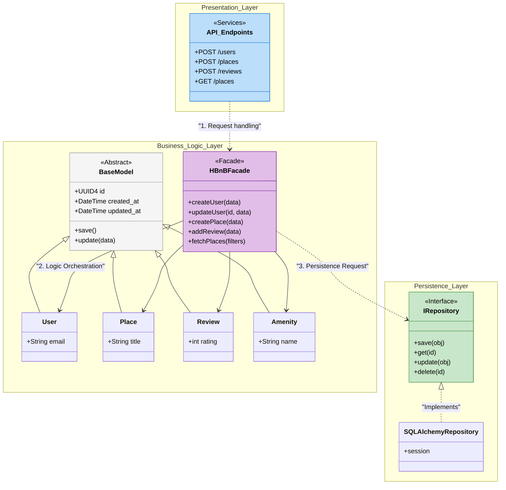
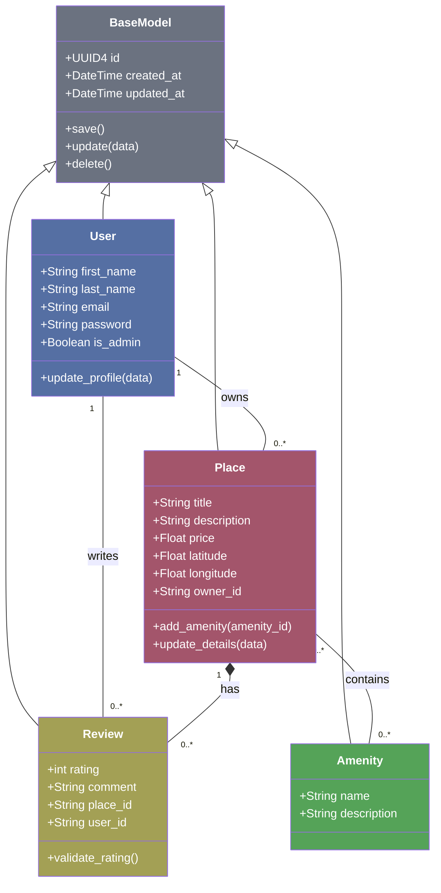
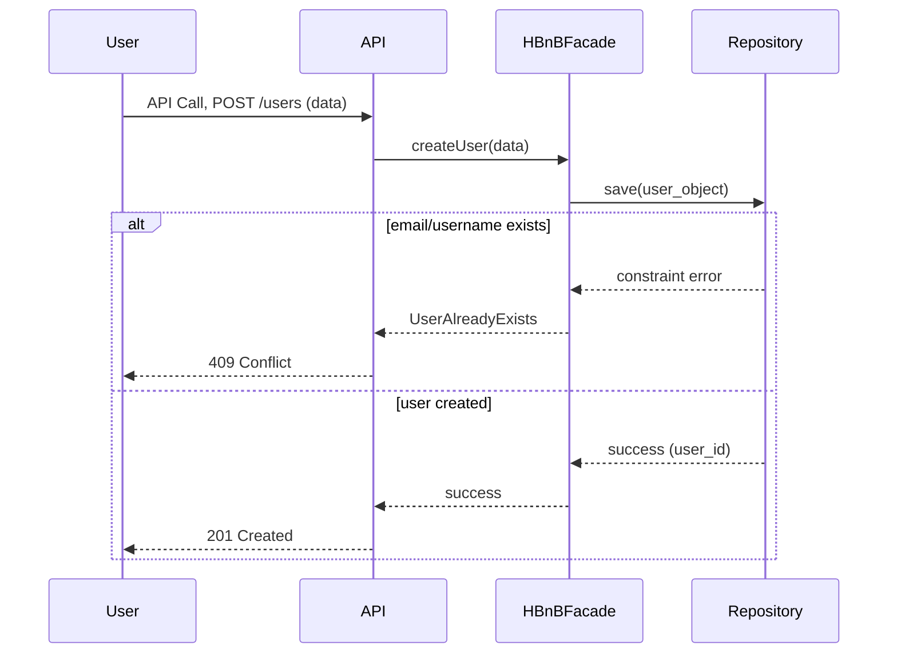
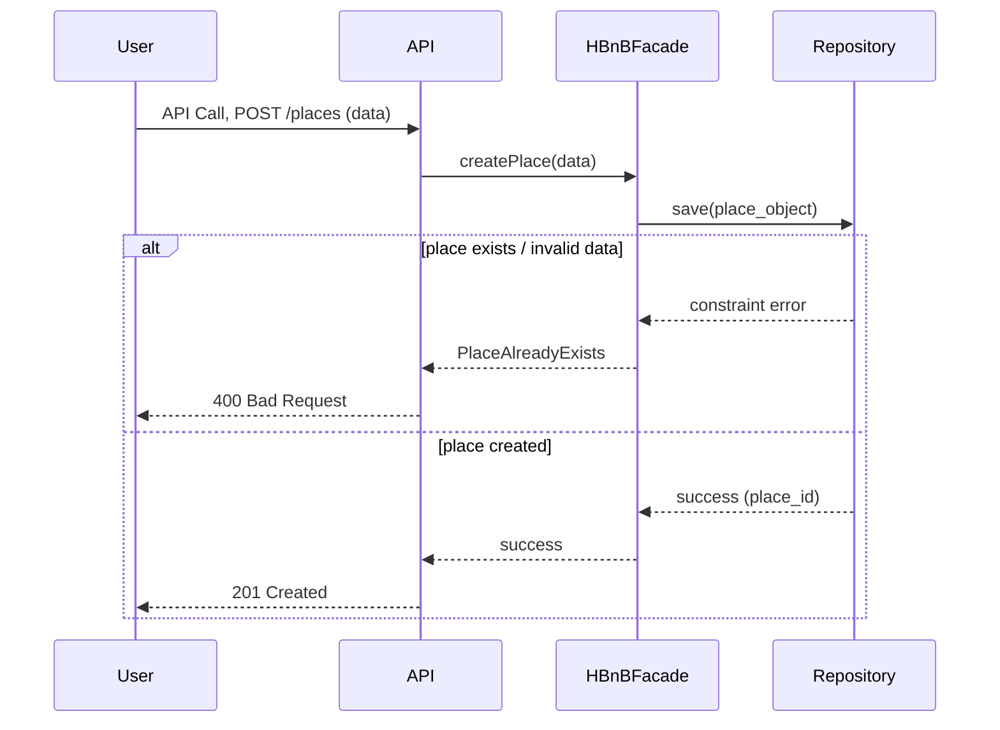
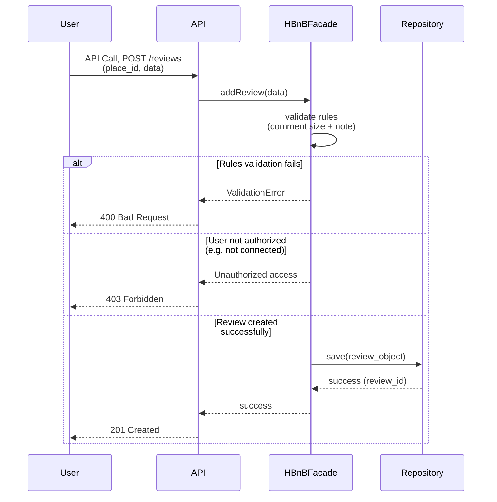
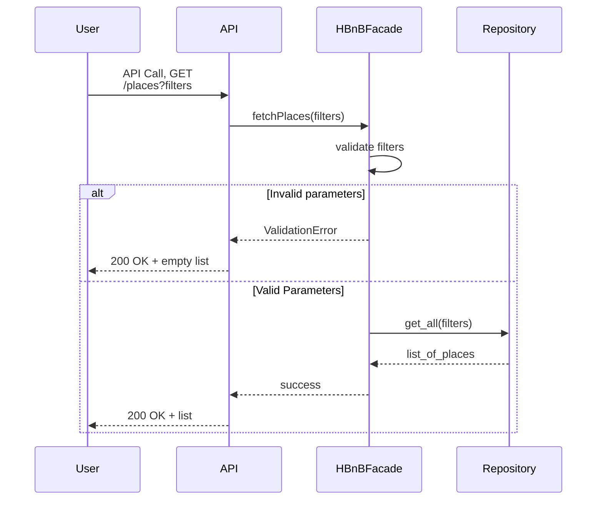

# HBnB Evolution: Technical Documentation
This technical document serves as a comprehensive blueprint for the HBnB Evolution project.  
It outlines the system architecture, business logic entities, and detailed API interaction flows to guide the implementation phase.
# 0. Package Diagram 

# Architecture Overview
The HBnB application is designed using a **three-tier layered architecture**.  
This structure promotes a clean separation of concerns by utilizing the Facade and Repository design patterns, ensuring that each layer has a distinct responsibility.

## Presentation Layer – API Endpoints
The `API_Endpoints` represent the entry point of the application. This layer is strictly responsible for:
*   **Exposing HTTP routes**: Providing endpoints such as `POST /users`, `POST /places`, `POST /reviews`, and `GET /places`.
*   **Request Handling**: Receiving client data, validating basic input formats, and forwarding the payload to the Business Layer.
*   **Response Formatting**: Returning the appropriate HTTP status codes and JSON data to the client.
---
## Business Logic Layer (Models & Facade)
This layer contains the "intelligence" of the system and is subdivided into two main components (HBnBFacade and BaseModel):
*   **HBnBFacade**: Acting as a Facade Pattern implementation, it serves as the unique intermediary between the API and the internal logic. It orchestrates complex operations—such as ensuring a User exists before creating a Place—simplifying the API's job and reducing system coupling. It provides simplified methods such as:
    + `createUser(data)`
    + `updateUser(id, data)`
    + `createPlace(data)`
    + `addReview(data)`
    + `fetchPlaces(filters)`
*   **Domain Models**: Entities like `User`, `Place`, `Review`, and `Amenity` define the core business objects. 
*   **BaseModel (Abstract Class)**: All entities inherit from this base class to ensure consistency. It provides universal attributes like `UUID4 id` and audit timestamps (`created_at`, `updated_at`), common methods (`save()`, `update(data)`) facilitating the **DRY (Don't Repeat Yourself) principle**.
---
## Persistence Layer – Repository Pattern
To keep the application database-agnostic, we use the Repository Pattern:

*   **IRepository (Interface)**: Defines the "contract" for data operations (`save`, `get`, `update`, `delete`). The Business Layer only talks to this interface, not knowing how the data is actually stored.
*   **SQLAlchemyRepository**: The concrete implementation that uses the **SQLAlchemy ORM** to communicate with the database. The facade interacts only with the `IRepository` interface, not directly with SQLAlchemy. This makes the system more flexible and easier to test.
*   **Benefit**: This abstraction makes the system highly flexible; we could switch from a SQL database to a NoSQL one without changing a single line of business logic.
---
## Flow of a Request
1. Request: A client sends an HTTP request to an API endpoint.
2. Delegation: The API layer parses the request and calls the corresponding method in the `HBnBFacade`.
3. Orchestration: The Facade applies business rules, interacts with the Domain Models, and triggers internal updates (like `BaseModel.update()`).
4. Persistence: The Facade calls `IRepository` to save the changes.
5. Database Interaction: The `SQLAlchemyRepository` executes the actual database commands via a session and commits the transaction.

---
---

# 1. Business Logic Layer - Class Diagram

#   Explanatory Notes
The **Business Logic Layer** is the core of the HBnB application. It defines the structure, behavior, and rules of the system's entities. This layer is designed to be independent of the database and the UI, ensuring that business rules are enforced consistently across the entire application.
##   Entities:
-   **BaseModel**: 
    +   The foundation of all classes. It encapsulates the `UUID4` unique identifier and audit timestamps (`created_at, updated_at`), ensuring that every object in the system is traceable and unique. 
    +   `save()`, `update()`, and `delete()` manage the basic lifecycle state of an instance before it is handed over to the persistence layer.
-   **User**: Represents a registered individual. It holds essential data like email and password, and manages roles (admin vs. regular user).
    +   Includes names, unique email, and an `is_admin` flag for authorization logic
    +   `update_profile(data)` allows the entity to manage its own state changes, adhering to the **Encapsulation** principle.
-   **Place**: Represents the properties listed. It includes geographical coordinates and pricing. 
    +   Stores physical details (coordinates, description) and pricing. It is linked to a `User` (Owner).
    +   `add_amenity()` manages the association with features, and `update_details()` allows for property modifications.
-   **Review**: A feedback entity that links a `User` with a `Place` through a rating and a comment.
    +   Contains a numeric rating and a text comment.
    +   `validate_rating()` ensures the data adheres to business rules (e.g., rating between 1 and 5) before persistence.
-   **Amenity**: Standalone features (like "WiFi" or "Pool") that enhance a Place.

##  Relationships:
-   **Inheritance**: All core entities inherit from `BaseModel`, promoting code reuse and a standardized data structure for auditing. By centralizing these attributes, any future entities added to the system will automatically inherit the ability to be uniquely identified via UUID4 and tracked through creation and update timestamps.
-   **One-to-Many (User → Place/Review)**: 
    +   A user can own multiple `Places` and write multiple `Reviews`.
    +   Each `Place` or `Review` belongs to a single `User`.
-   **Composition (Place ↔ Review)**: We used a Composition relationship (*--). 
    +   This implies that a `Review` cannot exist without a `Place`. 
    +   If a `Place` is deleted, its associated `Reviews` are also removed to maintain data integrity.
-   **Many-to-Many (Place ↔ Amenity)**: 
    +   A `Place` can have multiple `Amenities`
    +   An `Amenity` type can be associated with many different `Places`.

---
---

# 2.1 User Registration - Sequence Diagram

#   Explanatory Notes
##   Brief Description :
-   This API call allows a new **User** to register in the system by submitting required information such as email, username, and password.
-   The purpose of the **sequence diagram** is to illustrate how the system validates the input, processes the registration request, and either creates the user or returns an appropriate error response.

##  Flow of Interactions :
1)   **Request**: The User sends a `POST /users` request to the **API (Presentation Layer)** with the user's registration data.
2)   **Delegation**:The API receives the request and forwards the data to the **HBnBFacade** by calling the `createUser(data)` method.
3)   **Orchestration & Validation**: The HBnBFacade processes the request. It interacts with the **Repository** to attempt to persist the new user object.
4)   **Integrity Check**: The Repository (Persistence Layer) enforces data integrity, specifically checking for unique constraints (such as a unique email).
5)   **Error Handling**: If constraint is violated, the error is propagated:
    -   If the email or username already exists, the Repository returns a constraint error.
    -   The HBnBFacade translates this into a business-level error (`UserAlreadyExists`).
    -   The API returns an HTTP `409 Conflict` response to the User.
6)   **Success Path**:
    -   If the data is valid and unique, the Repository saves the object and returns a success confirmation.
    -   The HBnBFacade sends the success signal back to the **API**.
    -   The API responds to the User with an HTTP `201 Created` status and the new user identifier.

7)   Each layer contributes as follows:
    -   API: Acts as the entry point, managing HTTP communication and status codes.
    -   HBnBFacade (Business Logic): Applies business rules and orchestrates the flow between models and the storage system.
    -   Repository (Persistence Layer): Ensures data integrity and handles the actual storage operations within the database.

---

## 2.2 Place Creation - Sequence Diagram

#   Explanatory Notes
##   Brief Description :
-   This API call allows an authenticated User to create a new place listing (similar to Airbnb).
-   The **sequence diagram** shows how the HBnBFacade validates the submitted data and stores the new place in the Repository.

##  Flow of Interactions :
1)  **Request**: The User sends a `POST /places` request to the **API (Presentation Layer)** containing place details.
2)  **Delegation**: The API receives the request and forwards it to the HBnBFacade via the `createPlace(data)` method.
3)  **Orchestration & Validation**: The HBnBFacade validates the input and prepares the `place_object`
4)  **Persistence**: The HBnBFacade calls the `save(place_object)` method of the Repository
5)  **Integrity Check**: The Repository (Persistence Layer) handles the actual storage and enforces constraints.
6)  **Error Handling**: If constraint is violated, the error is propagated:
    -   The Repository returns an error to the HBnBFacade, which propagates it to the API.
    -   The API then returns an HTTP **400 Bad Request**.
7)  **Success Path**: If the registration is successful:
    -   The Repository returns the unique Place ID.
    -   The API responds to the User with an HTTP **201 Created** status
8)  **Layer Contributions**:
    -   **API (Presentation Layer)**: Manages HTTP communication and translates internal results into standard status codes.
    -   **HBnBFacade (Business Logic)**: Applies business rules and coordinates interactions between entities and storage.
    -   **Repository (Persistence Layer)**: Abstractly handles data storage, ensuring that the place is correctly persisted regardless of the database engine used.

## 2.3 Review Submission - Sequence Diagram

#   Explanatory Notes
##   Brief Description :
-   This API call allows a **User** to submit a review for a place, including a rating and a comment.
-   The **sequence diagram** illustrates how the HBnBFacade validates review content and coordinates with the **Repository** only after all business rules are satisfied.

##  Flow of Interactions :
1)   **Request**: The User sends a `POST /reviews` request to the `API (Presentation Layer)` with a rating, a comment and a `place_id`
2)   **Delegation**: The API receives the request and forwards it to the **HBnBFacade** via the `addReview(data)` method.
3)   **Business Logic Validation**: The HBnBFacade validates that the rating is within the allowed range (e.g., 1-5) and checks the comment length.
4)   The **Repository** ensures referential integrity, verifying that both the `place_id` and `user_id` exist before persisting the data.
5)   **Error Handling (Fail-Fast)**: If the validation fails:
    -   If the validation fails, the HBnBFacade returns a `ValidationError`, and the API responds with a **400 Bad Request**.
    -   If the user is not authorized or not connected, the system returns an `Unauthorized access` error, and the API responds with a **403 Forbidden**.
6)  **Persistence**: If all validations pass, the HBnBFacade prepares the `review_object` and calls the `save()` method of the Repository. 
    **Note**: We validate the data before sending it to the Repository to prevent unnecessary database operations.
7)   **Success Path**:
    -   The Repository persists the data and returns the new **Review ID**.
    -   The HBnBFacade confirms the operation, and the API returns a **201 Created** status.
8)  **Layer Contributions**:
    -   **API (Presentation Layer)**: Handles HTTP communication and translates internal logic results into appropriate status codes.
    -   **HBnBFacade**: Enforces business rules, validates data integrity, and orchestrates the flow of the review process.
    -   **Repository (Persistence Layer)**: Securely stores the review data and provides an abstraction for the underlying database.
---

## 2.4 Fetching a List of Places - Sequence Diagram

#   Explanatory Notes
##   Brief Description :
-   This API call allows a **User** to retrieve a list of places based on filtering criteria (e.g., city, price range, number of guests).
-   The **sequence diagram** demonstrates how the **HBnBFacade** processes filter parameters and coordinates with the Repository to return matching results.
##  Flow of Interactions :
1)   **Request**: The User sends a `GET /places` request to the **API (Presentation Layer)** with query parameters (e.g., `/places?city=Paris&price_max=100`).
2)   **Delegation**: The API receives the request and forwards the filters to the HBnBFacade via the `fetchPlaces(filters)` method.
3)   **Internal Validation**: The HBnBFacade performs a **self-call** to validate the parameters. This ensures that the logic layer handles business rules (like valid price scales) before involving the **persistence layer**.
4)   **Handling Results (Conditional Path)**:
    -   **Invalid Parameters**: If the filters are malformed, the HBnBFacade returns a `ValidationError`. However, to maintain a consistent user experience, the API translates this into a 200 OK response with an empty list.
    -   **Valid Parameters**: The HBnBFacade forwards the request to the **Repository** using the `get_all(filters)` method.
5)  **Data Retrieval**: The Repository executes the search against the storage and returns the matching results (or an empty list if no properties match the criteria).
6)  **Response**: The API formats the result into a JSON array and responds with a **Code 200 (OK)**.
7)  Layer Contributions:
    -   **API (Presentation Layer)**: Handles the HTTP `GET` request and ensures a standardized response format for the client.
    -   **HBnBFacade**: Acts as the system's brain, validating filters internally to ensure only logical queries proceed.
    -   **Repository (Persistence Layer)**: Handles the abstract data fetching, ensuring that the search is executed correctly regardless of the database engine.
