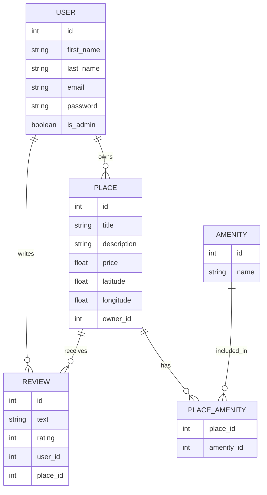

# HBnB - Part 3

## ER Diagram (Entity-Relationship Diagram)

### Les tables :
- User
- Place
- Review
- Amenity
- Place_Amenity (table de liaison)

| Relation        | Type         |
| --------------- | ------------ |
| User → Place    | One-to-Many  |
| User → Review   | One-to-Many  |
| Place → Review  | One-to-Many  |
| Place ↔ Amenity | Many-to-Many |

